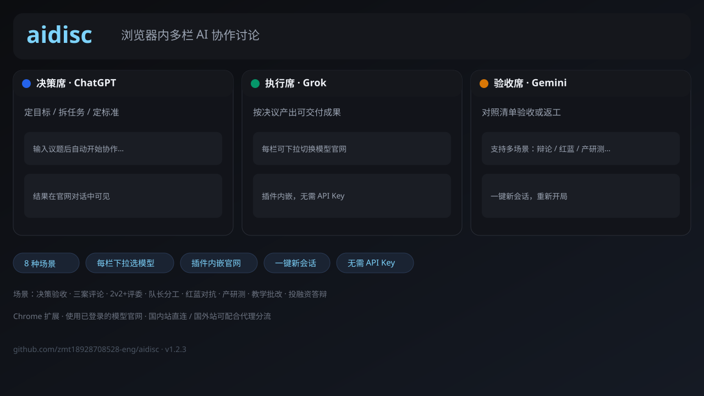

# aidisc

浏览器内多栏嵌入 AI 官网，按场景组织多人协作讨论。**无需 API Key**，使用你已登录的模型官网。

**仓库：** https://github.com/zmt18928708528-eng/aidisc

## 它是做什么的？

在 Chrome 插件里并排多个 AI 官网（ChatGPT / Grok / Gemini / DeepSeek / 通义等），按场景自动串行协作：

| 例如 | 流程 |
|------|------|
| 决策 → 执行 → 验收 | 一人拍板、一人落地、一人把关 |
| 2v2 辩论 + 评委 | 正反交锋后评委裁决 |
| 红队 / 蓝队 | 攻击找漏洞、防守修复、裁判定级 |
| 产品 + 设计 + 研发 + 测试 | 产研协作链 |

## 安装（完整包）

1. 下载 **[aidisc-v1.2.3.zip](https://github.com/zmt18928708528-eng/aidisc/releases)**（或对话中提供的完整包）
2. 解压
3. Chrome 打开 `chrome://extensions`
4. 开启「开发者模式」
5. 「加载已解压的扩展程序」，选中解压目录
6. 点工具栏图标打开 aidisc

## 全部场景

1. 决策 → 执行 → 验收
2. 三案并列 + 评论
3. 2v2 辩论 + 评委
4. 队长分配 + 并行 + 合并
5. 红队 / 蓝队安全评审
6. 产品 + 设计 + 研发 + 测试
7. 老师出题 / 学生作答 / 助教批改
8. 投资人质疑 + 创始人答辩

## 代理建议

- **国内模型**（通义、豆包、Kimi、DeepSeek 等）：直连
- **国外模型**（ChatGPT、Claude、Gemini、Grok）：通常需要代理，建议分流规则

版本 **1.2.3**
